# epoll
epoll的起源：\
epoll 是Linux内核中的一种I/O事件通知机制。它是 select 和 poll 这两个系统调用的增强版本，专为处理大量文件描述符而设计，特别是在需要高并发处理的应用程序中，如网络服务器和分布式系统。他的起源可以追溯到21世纪初，当时Linux系统在处理大量并发连接时遇到了性能瓶颈。select 和 poll 方法的性能随着文件描述符数量的增加而线性下降，因为它们需要检查每个文件描述符的状态。为了解决这个问题，Linux内核引入了 epoll。\
那么问题来了：\
1.select是什么，poll又是什么？\
2.用上面的为什么会产生瓶颈，而epoll有比他们强在了哪里？\
要了解这些，我们要从最基本的开始将其
### 一、从网卡接收数据说起
通过硬件传输，网卡接收的数据存放到内存中
### 二、如何知道接收了数据？
当网卡把数据写入到内存后，网卡向cpu发出一个中断信号，操作系统便能得知有新数据到来，再通过网卡中断程序去处理数据.
### 三，进程阻塞为什么不占用cpu资源？
阻塞是进程调度的关键一环，指的是进程在等待某事件（如接收到网络数据）发生之前的等待状态，recv、select和epoll都是阻塞方法。\
看1.c\
绑定这两个的目的是什么？\
绑定端口的目的：当内核收到 TCP 报文，通过 TCP 头里面的端口号，来找到我们的应用程序，然后把数据传递给我们。\
绑定 IP 地址的目的：一台机器是可以有多个网卡的，每个网卡都有对应的 IP 地址，当绑定一个网卡时，内核在收到该网卡上的包，才会发给我们；\
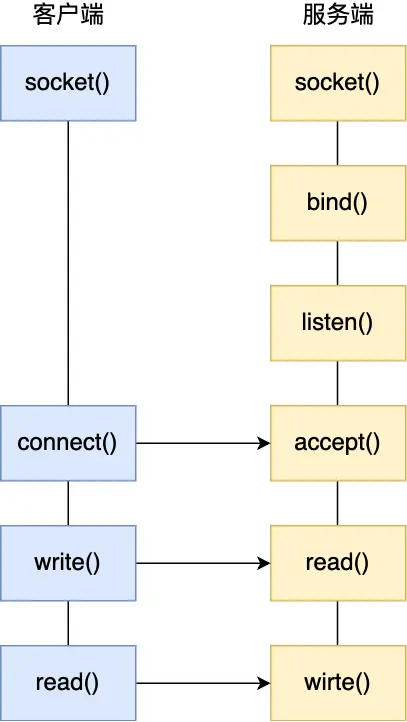\
那么阻塞的原理是什么？\
比如某个时候你在等快递，但是你不知道快递什么时候过来，而且你没有别的事可以干（或者说接下来的事要等快递来了才能做）；那么你可以去睡觉了，因为你知道快递把货送来时一定会给你打个电话（假定一定能叫醒你）。\
非阻塞忙轮询。接着上面等快递的例子，如果用忙轮询的方法，那么你需要知道快递员的手机号，然后每分钟给他挂个电话：“你到了没？”\
很明显一般人不会用第二种做法，不仅显很无脑，浪费话费不说，还占用了快递员大量的时间。\
大部分程序也不会用第二种做法，因为第一种方法经济而简单，经济是指消耗很少的CPU时间，如果线程睡眠了，就掉出了系统的调度队列，暂时不会去瓜分CPU宝贵的时间片了。\
操作系统为了支持多任务，实现了是阻塞状态，比如上述程序运行到recv时，程序会从运行状态变为等待状态，接收到数据后又变回运行状进程调度的功能，会把进程分为“运行”和“等待”等几种状态。运行状态是进程获得cpu使用权，正在执行代码的状态；等待状态态。\
举个例子：计算机中运行着A、B、C三个进程，其中进程A执行着上述基础网络程序，一开始，这3个进程都被操作系统的工作队列所引用，处于运行状态，会分时执行\
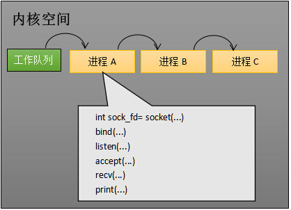\
但是当进程A执行到创建socket的语句时，操作系统会创建一个由文件系统管理的socket对象（如下图）。这个socket对象包含了发送缓冲区、接收缓冲区、等待队列等成员。等待队列是个非常重要的结构，它指向所有需要等待该socket事件的进程。\
当程序执行到recv时，操作系统会将进程A从工作队列移动到该socket的等待队列中（如下图）。由于工作队列只剩下了进程B和C，依据进程调度，cpu会轮流执行这两个进程的程序，不会执行进程A的程序。所以进程A被阻塞，不会往下执行代码，也不会占用cpu资源。\
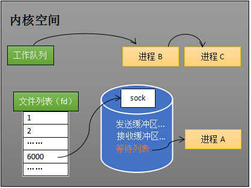\
哪怎样就有可以运行了呢？(唤醒进程)\
当socket接收到数据后，操作系统将该socket等待队列上的进程重新放回到工作队列，该进程变成运行状态，继续执行代码。也由于socket的接收缓冲区已经有了数据，recv可以返回接收到的数据。\
总结如下\
以上的全过程为\
进程在recv阻塞期间，计算机收到了对端传送的数据（步骤①）。数据经由网卡传送到内存（步骤②），然后网卡通过中断信号通知cpu有数据到达，cpu执行中断程序（步骤③）。此处的中断程序主要有两项功能，先将网络数据写入到对应socket的接收缓冲区里面（步骤④），再唤醒进程A（步骤⑤），重新将进程A放入工作队列中。\
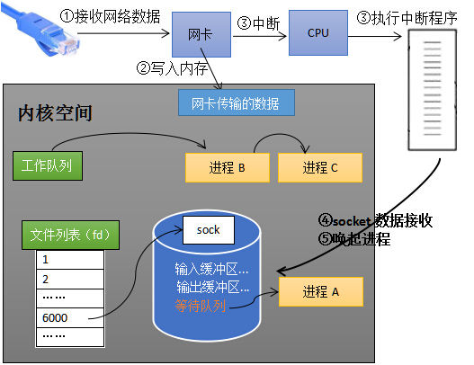\
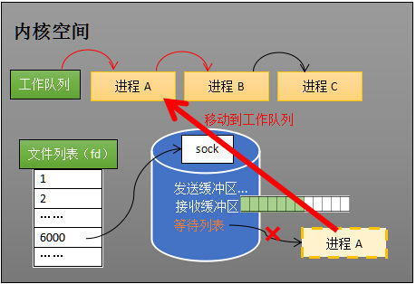\
#### 那么问题有来了
##### (1)操作系统如何知道网络数据对应于哪个socket？
解答：因为一个socket对应着一个端口号，而网络数据包中包含了ip和端口的信息，内核可以通过端口号找到对应的socket。具体就是，网卡接收数据包，将他传给操作系统的网络推zhan，操作系统解析数据包的头部信息，通过ip和端口信息，查处对应的socket。
##### (2)如何同时监视多个socket的数据？
下面详解
### 四,select!!!
服务端需要管理多个客户端连接，而recv只能监视单个socket，这种矛盾下，人们开始寻找监视多个socket的方法。epoll的要义是高效的监视多个socket。\
假如能够预先传入一个socket列表，如果列表中的socket都没有数据，挂起进程，直到有一个socket收到数据，唤醒进程。这种方法很直接，也是select的设计思想。\
#### 看2.c
先准备一个数组（下面代码中的fds），让fds存放着所有需要监视的socket。然后调用select，如果fds中的所有socket都没有数据，select会阻塞，直到有一个socket接收到数据，select返回，唤醒进程。用户可以遍历fds，通过FD_ISSET判断具体哪个socket收到数据，然后做出处理。\
举个例子\
假如程序同时监视如下图的sock1、sock2和sock3三个socket，那么在调用select之后，操作系统把进程A分别加入这三个socket的等待队列中\
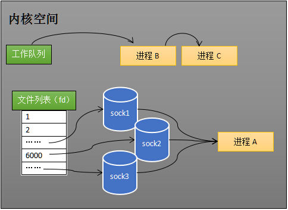\
当任何一个socket收到数据后，中断程序将唤起进程。sock2接收到了数据，中断程序唤起进程A\
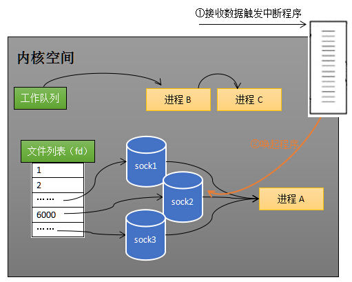\
唤起进程，就是将进程从所有的等待队列中移除，加入到工作队列里面\
\
当进程A被唤醒后，它知道至少有一个socket接收了数据。程序只需遍历一遍socket列表，就可以得到就绪的socket。
#### selet/poll的缺点：
select 实现多路复用的方式是，将已连接的 Socket 都放到一个文件描述符集合，然后调用 select 函数将文件描述符集合拷贝到内核里，让内核来检查是否有网络事件产生，检查的方式很粗暴，就是通过遍历文件描述符集合的方式，当检查到有事件产生后，将此 Socket 标记为可读或可写， 接着再把整个文件描述符集合拷贝回用户态里，然后用户态还需要再通过遍历的方法找到可读或可写的 Socket，然后再对其处理。\
所以，对于 select 这种方式，需要进行 2 次「遍历」文件描述符集合，一次是在内核态里，一个次是在用户态里 ，而且还会发生 2 次「拷贝」文件描述符集合，先从用户空间传入内核空间，由内核修改后，再传出到用户空间中。\
select 使用固定长度表示文件描述符集合，而且所支持的文件描述符的个数是有限制的，在 Linux 系统中，由内核中的 FD_SETSIZE 限制， 默认最大值为 1024，只能监听 0~1023 的文件描述符。\  
相比select模型，poll使用链表保存文件描述符，因此没有了监视文件数量的限制，但是 poll 和 select 并没有太大的本质区别，都是使用「线性结构」存储进程关注的 Socket 集合，因此都需要遍历文件描述符集合来找到可读或可写的 Socket，时间复杂度为 O(n)，而且也需要在用户态与内核态之间拷贝文件描述符集合，这种方式随着并发数上来，性能的损耗会呈指数级增长。\
那么，有没有减少遍历的方法？有没有保存就绪socket的方法？epoll闪亮登场！！！
### 五、epoll过程如下：
(1)创建epoll对象\
某个进程调用epoll_create方法时，内核会创建一个eventpoll对象（也就是程序中epfd所代表的对象）。eventpoll对象也是文件系统中的一员，和socket一样，它也会有等待队列。\
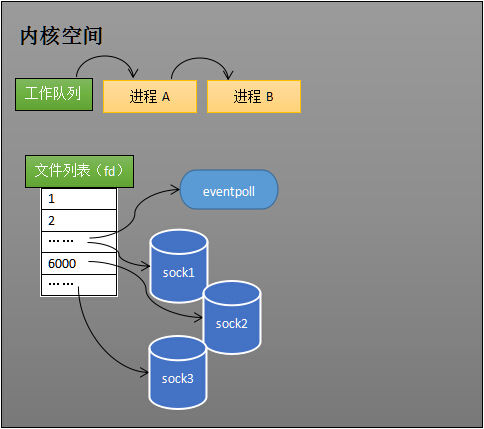\
(2)内核创建eventpoll对象\
创建一个代表该epoll的eventpoll对象是必须的，因为内核要维护“就绪列表”等数据，“就绪列表”可以作为eventpoll的成员。\
(3)维护监视列表\
创建epoll对象后，可以用epoll_ctl添加或删除所要监听的socket。\
举个例子：\
如果通过epoll_ctl添加sock1、sock2和sock3的监视，内核会将eventpoll添加到这三个socket的等待队列中。\
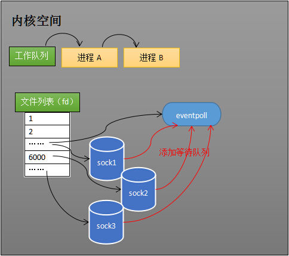\
(4)添加所要监听的socket\
当socket收到数据后，中断程序会操作eventpoll对象，而不是直接操作进程。\
(5)接收数据\
当socket收到数据后，中断程序会给eventpoll的“就绪列表”添加socket引用。如下图展示的是sock2和sock3收到数据后，中断程序让rdlist引用这两个socket。\
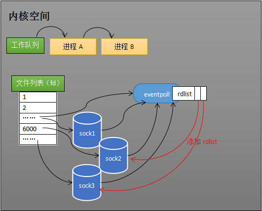\
(6)给就绪列表添加引用\
eventpoll对象相当于是socket和进程之间的中介，socket的数据接收并不直接影响进程，而是通过改变eventpoll的就绪列表来改变进程状态。\
当程序执行到epoll_wait时，如果rdlist已经引用了socket，那么epoll_wait直接返回，如果rdlist为空，阻塞进程。\
(7)阻塞和唤醒进程\
假设计算机中正在运行进程A和进程B，在某时刻进程A运行到了epoll_wait语句。如下图所示，内核会将进程A放入eventpoll的等待队列中，阻塞进程。\
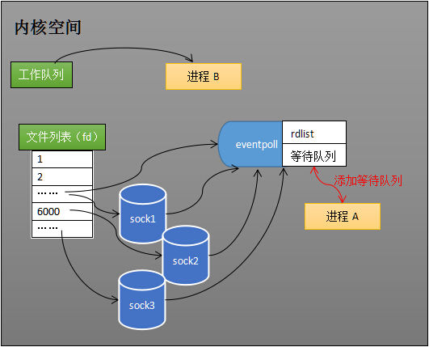\
epoll_wait阻塞进程\
当socket接收到数据，中断程序一方面修改rdlist，另一方面唤醒eventpoll等待队列中的进程，进程A再次进入运行状态\
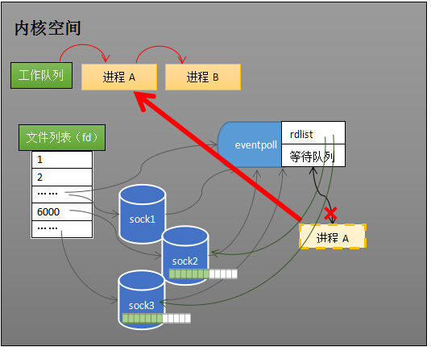\
epoll唤醒进程\
相应代码：
1. 文件描述符的创建\
#include <sys/epoll.h>\
int epoll_create ( int size );\
 在epoll早期的实现中，对于监控文件描述符的组织并不是使用红黑树，而是hash表。这里的size实际上已经没有意义。创建一个epoll的句柄。参数size是内核保证能够正确处理的最大文件描述符数目（现在内核使用红黑树组织epoll相关数据结构，自从linux2.6.8之后，size参数是被忽略的，>0的数即可）。需要注意的是，当创建好epoll句柄后，它就是会占用一个fd值，在linux下如果查看/proc/进程id/fd/，是能够看到这个fd的，所以在使用完epoll后，必须调用close()关闭，否则可能导致fd被耗尽。
 2.  注册监控事件\
 #include <sys/epoll.h>\
int epoll_ctl ( int epfd, int op, int fd, struct epoll_event *event );\
操作上面建立的epoll fd，例如，将刚建立的socket fd加入到epoll中让其监控，或者把 epoll正在监控的某个socket fd移出epoll，不再监控它等等。这个函数用于向epoll注册一个事件，而且明确监听的事件类型；第一个参数为epoll句柄，第二个参数表示对这个fd监听事件\
函数说明：\
     fd：要操作的文件描述符\
     op：指定操作类型\
操作类型：\
     EPOLL_CTL_ADD：往事件表中注册fd上的事件\
     EPOLL_CTL_MOD：修改fd上的注册事件\
     EPOLL_CTL_DEL：删除fd上的注册事件\
     event：指定事件，它是epoll_event结构指针类型\
     epoll_event定义：\
     struct epoll_event\
  {\
      __unit32_t events;    // epoll事件\
      epoll_data_t data;     // 用户数据 \
  };\
  结构体说明：\
     events：描述事件类型，和poll支持的事件类型基本相同（两个额外的事件：EPOLLET和EPOLLONESHOT，高效运作的关键）\
     data成员：存储用户数据\
      typedef union epoll_data\
  {\
      void* ptr;              //指定与fd相关的用户数据\
      int fd;                 //指定事件所从属的目标文件描述符\
      uint32_t u32;\
      uint64_t u64;\
  } epoll_data_t;
3. epoll_wait函数\
#include <sys/epoll.h>\
int epoll_wait ( int epfd, struct epoll_event* events, int maxevents, int timeout );\
在给定的timeout时间内，当在监控的这些文件描述符中的某些文件描述符上有事件发生时，就返回用户态的进程。这个函数用于等待事件的发生．第二个参数是用户自己开辟的一块事件数组，用于存储就绪的事件，第三个参数为这个数组的最大值，就是第二个参数事件数组的最大值，用户想监听fd的个数，第四个参数为超时时间(0表示立即返回，-1表示永久阻塞，直到有就绪事件)\
函数说明：\
     返回：成功时返回就绪的文件描述符的个数，失败时返回-1并设置errno\
     timeout：指定epoll的超时时间，单位是毫秒。当timeout为-1是，epoll_wait调用将永远阻塞，直到某个时间发生。当timeout为0时，\epoll_wait调用将立即返回。\
     maxevents：指定最多监听多少个事件\
     events：检测到事件，将所有就绪的事件从内核事件表中复制到它的第二个参数events指向的数组中。\
总结：我们在调用 epoll_create 时，内核除了帮我们在 epoll 文件系统里建了个 file 结点，在内核 cache 里建了个红黑树用于存储以后 epoll_ctl 传来的 socket 外，还会再建立一个 rdllist 双向链表，用于存储准备就绪的事件，当 epoll_wait 调用时，仅仅观察这个 rdllist 双向链表里是否有 epitem 元素,如果 rdllist 链表不为空，则这里的事件复制到用户态内存中，同时将事件数量返回给用户，没有数据就 sleep，等到 timeout 时间到后即使链表没数据也返回。所以，epoll_wait 非常高效。、
所有添加到 epoll 中的事件都会与设备(如网卡)驱动程序建立回调关系，也就是说相应事件的发生时会调用这里的回调方法。这个回调方法在内核中叫做 ep_poll_callback，它会把这样的事件放到上面的 rdllist 双向链表中。
### 六、epoll的实现细节
问题：\
eventpoll的数据结构是什么样子？\
就绪队列应该应使用什么数据结构？\
eventpoll应使用什么数据结构来管理通过epoll_ctl添加或删除的socket？\
当某一进程调用epoll_create方法时，Linux内核会创建一个eventpoll结构体，这个结构体中有两个成员与epoll的使用方式密切相关。eventpoll结构体如下所示：\
struct eventpoll{\
 ....\
 /*红黑树的根节点，这颗树中存储着所有添加到epoll中的需要监控的事件*/\
 struct rb_root rbr;\
 /*双链表中则存放着将要通过epoll_wait返回给用户的满足条件的事件*/\
 struct list_head rdlist;\
 ....\
};\
每一个epoll对象都有一个独立的eventpoll结构体，用于存放通过epoll_ctl方法向epoll对象中添加进来的事件。这些事件都会挂载在红黑树中，如此，重复添加的事件就可以通过红黑树而高效的识别出来(红黑树的插入时间效率是lgn，其中n为树的高度)。\
而所有添加到epoll中的事件都会与设备(网卡)驱动程序建立回调关系，也就是说，当相应的事件发生时会调用这个回调方法。这个回调方法在内核中叫ep_poll_callback,它会将发生的事件添加到rdlist双链表中。\
在epoll中，对于每一个事件，都会建立一个epitem结构体，如下所示：\
struct epitem{\
 struct rb_node rbn;//红黑树节点\
 struct list_head rdllink;//双向链表节点\
 struct epoll_filefd ffd; //事件句柄信息\
 struct eventpoll *ep; //指向其所属的eventpoll对象\
 struct epoll_event event; //期待发生的事件类型\
}\
eventpoll与epitem的联系如下图:\
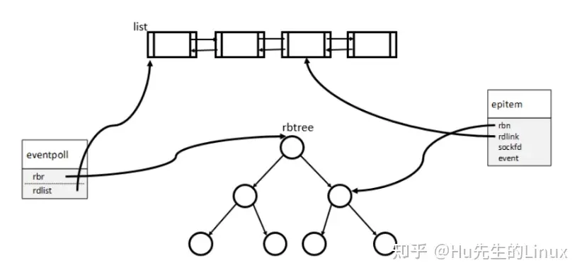\
当我们使用epoll_ctl()函数注册一个socket时，内核将会做这些事情:\
1.分配一个红黑树节点对象epitem\
2.添加等待事件到socket的等待队列中\
3.将epitem插入到epoll对象的红黑树中\
当调用epoll_wait检查是否有事件发生时，只需要检查eventpoll对象中的rdlist双链表中是否有epitem元素即可。如果rdlist不为空，则把发生的事件复制到用户态，同时将事件数量返回给用户。\
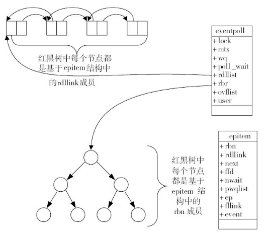\
红黑树的结点和就绪队列的结点的同一个节点，所谓的加入就绪队列，就是将结点的前后指针联系到一起。所以就绪了不是将红黑树结点delete掉然后加入队列。他们是同一个结点，不需要delete。\
就绪列表的数据结构\
就绪列表引用着就绪的socket，所以它应能够快速的插入数据。\
程序可能随时调用epoll_ctl添加监视socket，也可能随时删除。当删除时，若该socket已经存放在就绪列表中，它也应该被移除。\
所以就绪列表应是一种能够快速插入和删除的数据结构。双向链表就是这样一种数据结构，epoll使用双向链表来实现就绪队列（对应上图的rdllist）。\
索引结构\
既然epoll将“维护监视队列”和“进程阻塞”分离，也意味着需要有个数据结构来保存监视的socket。至少要方便的添加和移除，还要便于搜索，以避免重复添加。红黑树是一种自平衡二叉查找树，搜索、插入和删除时间复杂度都是O(log(N))，效率较好。epoll使用了红黑树作为索引结构（对应上图的rbr）。
### 七、epoll边缘触发和水平触发(ET与LT模式)
LT（水平触发）模式下，只要这个文件描述符还有数据可读，每次 epoll_wait 都会返回它的事件，提醒用户程序去操作；\
ET（边缘触发）模式下，在它检测到有 I/O 事件时，通过 epoll_wait 调用会得到有事件通知的文件描述符，对于每一个被通知的文件描述符，如可读，则必须将该文件描述符一直读到空，让 errno 返回 EAGAIN 为止，否则下次的 epoll_wait 不会返回余下的数据，会丢掉事件。如果 ET 模式不是非阻塞的，那这个一直读或一直写势必会在最后一次阻塞。\
一般来说，边缘触发的效率比水平触发的效率要高，因为边缘触发可以减少 epoll_wait 的系统调用次数，系统调用也是有一定的开销的的，毕竟也存在上下文的切换。\
select/poll 只有水平触发模式，epoll 默认的触发模式是水平触发，但是可以根据应用场景设置为边缘触发模式。\
看3.c\
如果采用 EPOLLLT 模式的话，系统中一旦有大量你不需要读写的就绪文件描述符，它们每次调用 epoll_wait 都会返回，这样会大大降低处理程序检索自己关心的就绪文件描述符的效率.。而采用 EPOLLET 这种边缘触发模式的话，当被监控的文件描述符上有可读写事件发生时，epoll_wait()会通知处理程序去读写。如果这次没有把数据全部读写完(如读写缓冲区太小)，那么下次调用 epoll_wait()时，它不会通知你，也就是它只会通知你一次，直到该文件描述符上出现第二次可读写事件才会通知你！！！这种模式比水平触发效率高，系统不会充斥大量你不关心的就绪文件描述符。\
#### 那么说了这么多，同学心中是否村有自己大大小小的疑问呢？
(1)什么是I/O复用?\
(2)是否有了epoll，select/poll就可以抛弃?\
(3)是否所有的文件类型都可以被 epoll 监视?\
(4)为啥epoll加需要监听的socket时用的是红黑树？而就绪列表用的是双向链表\
(1)I/O就是指网络中的I/O（即输入输出），多路是指多个TCP连接，复用是指一个或少量线程被重复使用。连起来理解就是，用少量的线程来处理网络上大量的TCP连接中的I/O。\
(2)当监测的fd数量较小，且各个fd都很活跃的情况下，建议使用select/poll；当监听的fd数量较多，且单位时间仅部分fd活跃的情况下，使用epoll的性能会很好\
(3)NO。 只有底层驱动实现了 file_operations 中 poll 函数的文件类型才可以被 epoll 监视！socket 类型的文件驱动是实现了 poll 函数的，因此才可以被 epoll 监视\
(4)如果使用hash进行存储，其优点是查询速度很快，O(1)。但是在我们调用epoll_create()的时候，hash底层的数组创建多大合适呢？如果我们有百万的fd，那么这个数组越大越好，如果我们仅仅十几个fd需要管理，在创建数组的时候，太大的空间就很浪费。而这个fd我们又不能预先知道有多少，所以hash是不合适的。\
在内存索引的场景下我们一般使用红黑树来作为首选的数据结构，首先红黑树的查找速度很快,O(log(N))。其次在调用epoll_create()的时候，只需要创建一个红黑树树根即可，无需浪费额外的空间。\
那么就绪集合用什么数据结构呢，首先就绪集合不是以查找为主的，就绪集合的作用是将里面的元素拷贝给用户进行处理，所以集合里的元素没有优先级，那么就可以采用线性的数据结构，使用队列来存储，先进先出，先就绪的先处理.

