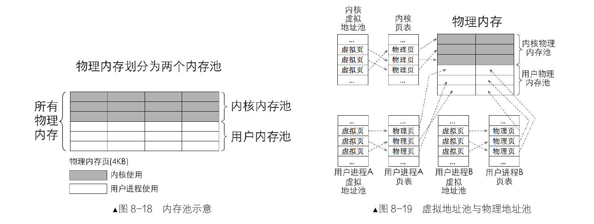
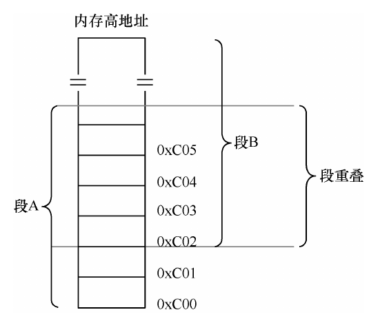
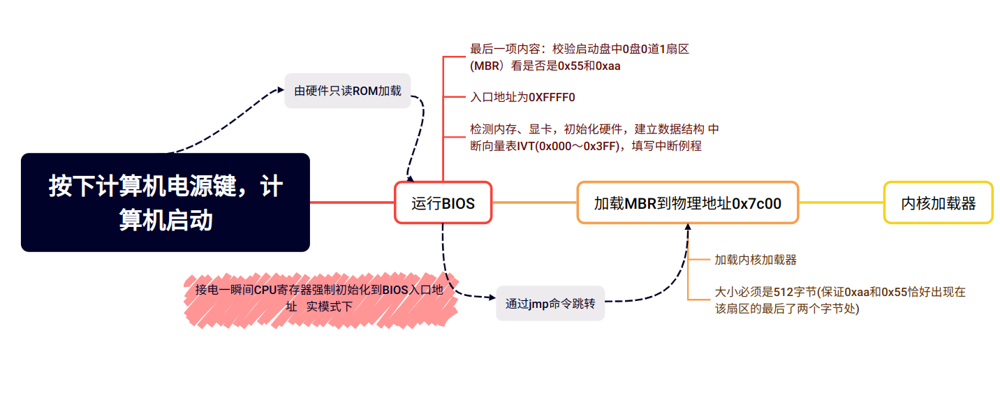
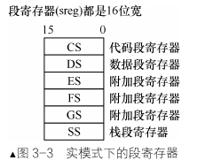

# 操作系统真相还原
 
-[真相还原gogogo!](#真相还原gogogo!)\
 -[第0章：一些你可能正感到迷惑的问题](#第0章：一些你可能正感到迷惑的问题)\
  -[软件如何访问硬件](#软件如何访问硬件)\
  -[特权级](#特权级)\
  -[内存访问为什么要分段](#内存访问为什么要分段)
  -[代码中为什么分为代码段、数据段？这和内存访问机制中的段是一回事吗](#代码中为什么分为代码段、数据段？这和内存访问机制中的段是一回事吗)\
  -[物理地址、逻辑地址、有效地址、线性地址、虚拟地址的区别](#物理地址、逻辑地址、有效地址、线性地址、虚拟地址的区别)\
  -[什么是段重叠](#什么是段重叠)\
  -[平坦模型](#平坦模型)\
  -[BIOS中断、DOS中断、Linux中断的区别](#BIOS中断、DOS中断、Linux中断的区别)\
  -[局部变量和函数参数为什么要放在栈中](#局部变量和函数参数为什么要放在栈中)\
  -[Section和Segment的区别](#Section和Segment的区别)\
  -[BIOS、MBR、DBR、OBR](#BIOS、MBR、DBR、OBR)\
 -[第二章：编写MBR主引导记录，让我们开始掌权](#第二章：编写MBR主引导记录，让我们开始掌权)\
  -[0x7c00?Why???](#0x7c00?Why???)\
 -[第三章：完善MBR](#第三章：完善MBR)\
  -[计算机启动过程](#计算机启动过程)\
  -[CPU的实模式](#CPU的实模式)\
  -[CPU工作原理](#CPU工作原理)\
  -[CPU的寄存器](#CPU的寄存器)\
  -[实模式下CPU内存寻址方式](#实模式下CPU内存寻址方式)\
   -[寄存器寻址](#寄存器寻址)\
   -[立即数寻址](#立即数寻址)\
   -[内存寻址](#内存寻址)\
   -[直接寻址](#直接寻址)\
   -[基址寻址](#基址寻址)\
   -[変址寻址](#変址寻址)\
   -[基址变址寻址](#基址变址寻址)\
  -[实模式下的ret](#实模式下的ret)\
  -[实模式下的call](#实模式下的call)\
   -[16位实模式相对近调用](#16位实模式相对近调用)\
   -[16位实模式间接绝对近调用](#16位实模式间接绝对近调用)\
   -[16位实模式直接绝对远调用](#16位实模式直接绝对远调用)\
   -[16位实模式间接绝对远调用](#16位实模式间接绝对远调用)\
  -[实模式下的jmp](#实模式下的jmp)\
  -[让我们直接对显示器说点什么吧](#让我们直接对显示器说点什么吧)\
   -[CPU如何与外设通信—IO接口](#CPU如何与外设通信—IO接口)\
   -[显卡概述](#显卡概述)\
   -[显存、显卡、显示器](#显存、显卡、显示器)\
  -[硬盘介绍](#硬盘介绍)\
   -[硬盘控制器端口](#硬盘控制器端口)\
   -[常用的硬盘操作方法](#常用的硬盘操作方法)\
-[第4章:保护模式入门](#第4章保护模式入门)\
 -[保护模式概述](#保护模式概述)\
  -[为什么要有保护模式](#为什么要有保护模式)\
  -[实模式不是32位cpu,变成了16位](#实模式不是32位cpu,变成了16位)\
 -[初见保护模式](#初见保护模式)\
  -[保护模式之寄存器扩展](#保护模式之寄存器扩展)\
  -[保护模式之寻址扩展](#保护模式之寻址扩展)\
  -[保护模式之运行模式反转](#保护模式之运行模式反转)\
  -[保护模式之指令扩展](#保护模式之指令扩展)\
 -[全局描述符表](#全局描述符表)\
  -[段描述符](#段描述符)\
  -[全局描述符表GDT、局部描述符表LDT及选择子](#全局描述符表GDT、局部描述符表LDT及选择子)\
  -[打开A20地址线](#打开A20地址线)\
  -[保护模式的开关，CR0寄存器的PE位](#保护模式的开关，CR0寄存器的PE位)\
  -[流水线](#流水线)\
  -[乱序执行](#乱序执行)\
  -[缓存](#缓存)\
  -[分支预测](#分支预测)\
  -[使用远跳转指令清空流水线，更新段描述符缓冲寄存器](#使用远跳转指令清空流水线，更新段描述符缓冲寄存器)\
 -[保护模式之内存段的保护](#保护模式之内存段的保护)\
  -[向段寄存器加载选择子时的保护](#向段寄存器加载选择子时的保护)\
  -[代码段和数据段的保护](#代码段和数据段的保护)\
  -[栈段的保护](#栈段的保护)\


  


## 第0章：一些你可能正感到迷惑的问题

### 软件如何访问硬件

+ 硬件更新非常迅速，操作系统为了适应各种不断迭代更新的硬件，出现了各种硬件适配器（`IO`接口）

+ 接口分为串行接口和并行接口

访问外部硬件有两个方式

1. 将某个外设的内存映射到一定范围的地址空间中,`CPU` 通过地址总线访问该内存区域时会落到外设的内存中,这种映射让 `CPU` 访问外设的内存就如同访问主板上的物理内存一样。例如显卡，显卡是显示器的适配器，CPU 不直接和显示器交互，它只和显卡通信。显卡上有片内存叫显存，它被映射到主机物理内存上的低端 1MB 的 0xB8000～0xBFFFF。CPU 访问这片内存就是访问显存，往这片内存上写字节便是往屏幕上打印内容。

2. 外设是通过 `IO` 接口与 `CPU` 通信的,`CPU` 访问外设,就是访问 `IO` 接口,由 `IO` 接口将信息传递给另一端的外设,也就是说,`CPU` 从来不知道有这些设备的存在,它只知道自己操作的 `IO` 接口。

>  如何访问到 `IO` 接口呢
>
> 答案就是 `IO` 接口上面有一些寄存器,访问 `IO` 接口本质上就是访问这些寄存器,这些寄存器就是人们常说的端口。这些端口是人家 `IO` 接口给咱们提供的接口。

------


### 特权级

+ 应用程序处于特权级 3,操作系统内核处于特权级 0。

+  扩展：

用户进程陷入内核态是指：由于内部或外部中断发生，当前进程被暂时终止执行，其上下文被内核的 中断程序保存起来后，开始执行一段内核的代码。是内核的代码，不是用户程序在内核的代码，用户代码 怎么可能在内核中存在，所以“用户态与内核态”是对 CPU 来说的。


### 内存访问为什么要分段

分段是给`CPU`用的访问内存的方式。

 + 早期程序运行时使用的是物理地址，编译后的代码在物理内存中起始地址相同，代码会发生冲突，相互覆盖。
 程序分段首先是为了重定位，重定位可以将物理地址冲突的程序挪到其他段

 + 程序分段首先是为了重定位，重定位可以将物理地址冲突的程序挪到其他段

> 1M 是 2 的 20 次方,1MB 内存需要 20 位的地址才能访问到,如何做到用 16 位寄存器访问 20 位地址空间呢?
>
> 这是因为 CPU 设计者在地址处理单元中动了手脚,该地址部件接到“段基址+段内偏移地址”的地址后,自动将段基址乘以 16,即左移了 4 位,然后再和 16 位的段内偏移地址相加,这下地址变成了 20 位了

------

#### 代码中为什么分为代码段、数据段？这和内存访问机制中的段是一回事吗

**程序不是一定要分段才能运行的,分段只是为了使程序更加优美。**

只要给出 `CPU` 第一个指令的起始地址,`CPU` 在它执行本指令的同时,它会自动获取下一条的地址,然后重复上述过程,继续执行,继续取址。这就要求程序中的指令都是挨着的，彼此之间无空隙。

> 程序中不是有对齐这回事吗?为了对齐,编译器在程序中塞了好多 0。是的,对齐确实是让程序中出现了好多空隙,但这些空隙是数据间的空隙,指令间不存在空隙,下一条指令的地址是按照前面指令的尺寸大小排下来的。即使指令间有空隙或其他非指令的数据,这也仅仅是在物理上将其断开了,依然可以用 `jmp`指令将非指令部分跳过以保持指令在逻辑上连续

**为了让程序内指令接连不断地执行,要把指令全部排在一起,形成一片连续的指令区域,这就是代码段。把数据连续地并排在一起存储形成的段落，就称为数据段。**

**尽量把同一属性的数据放在一起,这样易于维护。** 这样有以下好处：


- 可以为它们赋予不同的属性。数据需要有可写的属性，代码需要有只读的属性。
- 为了提高 `CPU` 内部缓存的命中率。
- 节省内存。程序中存在一些只读的部分,比如代码,当一个程序的多个副本同时运行时(比如同时执行多个 ls命令时),没必要在内存中同时存在多个相同的代码段,这将浪费有限的物理内存资源,只要把这一个代码段共享就可以了。

> 数据段或代码段的属性是谁给添加上的呢,是谁又去根据属性保护程序的呢
>
> 编译器.他负责挑选出数据具备的属性,从而根据属性将程序片段分类,比如,划分出了只读属性的代码段和可写属性的数据段。
>
> 操作系统通过设置 `GDT` 全局描述符表来构建段描述符,在段描述符中指定段的位置、大小及属性(包括 `S` 字段和 `TYPE` 字段)。是真正给段添加属性的地方。
>
> `CPU` 中的段寄存器提前被操作系统赋予相应的选择子,从而确定了指向的段。

总结一下,**程序中的段只是逻辑上的划分,用于不同数据的归类,但是可以用 `CPU` 中的段寄存器直接指向它们**,然后用内存分段机制去程序中分段在平坦模型中访问程序中的段。

内存分段机制？

------

#### 物理地址、逻辑地址、有效地址、线性地址、虚拟地址的区别

+ 物理地址就是物理内存真正的地址，相当于内存中每个存储单元的门牌号，具有唯一性。不管在什么模式下， 不管什么虚拟地址、线性地址，CPU 最终都要以物理地址去访问内存，只有物理地址才是内存访问的终点站。

+ 在实模式下，“段基址+段内偏移地址”经过段部件的处理，直接输出的就是物理地址，CPU 可以直 接用此地址访问内存。

+ 而在保护模式下，“段基址+段内偏移地址”称为线性地址，此时的段基址是选择子。

+ 若没有开启地址分页功能， 此线性地址就被当作物理地址来用，可直接访问内存。若开启了分页功能，此线性地址又多了一个名字，就是 虚拟地址。



------

#### 什么是段重叠

`CPU` 的内存寻址方式是:给我一个段基址,再给我一个相对于该段起始位置的偏移地址,我就能访问到相应内存。它并不要求一个内存地址只隶属于某一个段,所以在上面的图  中,欲访问内存 `0xC03`,段基址可以选择 `0xC00`, `0xC01`,`0xC02`,`0xC03`,只不过是段内偏移量要根据段基地址来调整罢了。用这种“段基地址:段内偏移”的组合,`0xC00:3` 和`0xC02:1` 是等价的,它们都访问到同一个物理内存块。但段的大小决定于段内偏移地址寻址范围,假设段 A 的段基址是从 0xC00 `开始`,段 B 的段基址是从 `0xC02` 开始,在 16 位宽度的寻址范围内,这两个段都能访问到 `0xC05` 这块内存。用段 A 去访问,其偏移为 5,用段 B 去访问,其偏移量为 3。这样一来,用段 B 和段 A 在地址 0xC02 之后,一直到段 B偏移地址为 `0xfffe` 的部分,像是重叠在一起了,这就是段重叠。



------


### 平坦模型

平坦模型（Flat Model）是一种**内存管理模型**，它将整个物理内存视为单一的、连续的地址空间，不区分段。这与分段模型和分页模型是相对的。

在平坦模型中，**内存地址由一个单一的线性地址空间表示，该空间从零开始，一直延伸到系统支持的最大物理地址。** 这种模型简化了内存管理，使得程序员不需要关心段的概念，而是使用连续的线性地址。

------


### 寄存器

`CS`—代码段寄存器(`Code Segment Register`),其值为代码段的段基值。

`DS`—数据段寄存器(`Data Segment Register`),其值为数据段的段基值

`ES`—附加段寄存器(`Extra Segment Register`),其值为附加数据段的段基值,称为“附加”是因为此段寄存器用途不像其他 `sreg` 那样固定,可以额外做他用。

`FS`—附加段寄存器(`Extra Segment Register`),其值为附加数据段的段基值,同上,用途不固定,使用上灵活机动。

`GS`—附加段寄存器(`Extra Segment Register`),其值为附加数据段的段基值。

`SS`—堆栈段寄存器(`Stack Segment Register`),其值为堆栈段的段值。

> 32 位 `CPU` 有两种不同的工作模式:实模式和保护模式。
> 每种模式下,段寄存器中值的意义是不同的,但不管其为何值,在段寄存器中所表达的都是指向的段在哪里。
>
> 在实模式下,`CS`、`DS`、`ES`、`SS` 中的值为段基址,是具体的物理地址,内存单元的逻辑地址仍为“段基值:段内偏移量”的形式。在保护模式下,装入段寄存器的不再是段地址,而是“段选择子”(`Selector`),当然,选择子也是数值,其依然为 16 位宽度。

综上所述，在32位CPU中，不管在16为实模式还是32位保护模式下，用的段寄存器都是同一组,`sreg` 都是 16 位宽。

------

### BIOS中断、DOS中断、Linux中断的区别
+ 如果事件来自于 CPU 内部就称为异常，即 Exception,如果事件来自于外部，也就是该事件由外部设备发出并通知了 CPU，这个事件就称为中断
+ 计算机 启动之初，中断向量表中的中断例程是由 BIOS 建立的，它从物理内存地址 0x0000 处初始化并在中断向 量表中添加各种处理例程
 > BIOS 为什么添加中断处理例程呢？
 > 
 > 1.给自己用，因为 BIOS 也是一段程序，是程序就很可能要重复性地执行某段代码，它直接将其写 成中断函数，直接调用多省心
 > 2.给后来的程序用，如加载器或 boot loader。它们在调用硬件资源时就不需要自己重写代码了

 ------

 > CPU 如何访问到外设的 ROM
 >
 > 1.内存映射：通过地址总线将外设自己的内存映射到某个内存区域（并不是映射到主板上插的内存条中）
 >  2.端口操作：外设都有自己的控制器，控制器上有寄存器，这些寄存器就是所谓的端口，通过 in/out 指令读写端口来访问硬件的内存

------
+ Linux中断

Linux 内核是在进入保护模式后才建立中断例程的，不过在保护模式下，中断向量表已经不存在了， 取而代之的是中断描述符表（Interrupt Descriptor Table，IDT）。Linux 的系统调用和 DOS 中断调用类似，不过 Linux 是通过 int 0x80 指令进入一个中断程序后再根据 eax 寄存器的值来调用不同的子功能函数的。如果在实模式下执行 int 指令，会自动去访问 中断向量表。如果在保护模式下执行 int 指令，则会自动访问中断描述符表


### 局部变量和函数参数为什么要放在栈中

局部变量只是自己在用,放在数据段中纯属浪费空间,没有必要,故将其放在自己的栈中,随时可以清理,真正体现了局部的意义。

函数参数为什么会放到栈区呢?

- 第一也是其局部性导致的,只有这个函数用这个参数,何必将其放在数据段呢。
- 第二,这是因为函数是在程序执行过程中调用的,属于动态的调用,编译时无法预测会何时调用及被调用的次数，其参数和函数的返回地址也要内存来存储,所以也不知道其会需要多少内存。

------

### Section和Segment的区别

section 称为节,是指在汇编源码中经由关键字 section 或 segment 修饰、逻辑划分的指令或数据区域,汇编器会将这两个关键字修饰的区域在目标文件中编译成节,也就是说“节”最初诞生于目标文件中。

segment 称为段,是链接器根据目标文件中属性相同的多个 section 合并后的 section 集合,这个集合称为 segment,也就是段,链接器把目标文件链接成可执行文件,因此段最终诞生于可执行文件中。

------


### BIOS、MBR、DBR、OBR

BIOS是计算机接电后运行的第一个程序

MBR会在BIOS干完一些基础工作后从BIOS那接手系统的控制权（BIOS将0盘0道1扇区的MBR加载到物理地址0x7c00）

MBR将系统控制权交给内核加载器OBR

MBR 引导扇区中的内容是：

   + 446 字节的引导程序及参数
   + 64 字节的分区表；
   + 2 字节结束标记 0x55 和 0xaa。


OBR是DBR遗留下来的,DBR 中的内容大概是：

   + 跳转指令，使 MBR 跳转到引导代码
   + 厂商信息、DOS 版本信息
   + BIOS 参数块 BPB，即 BIOS Parameter Block
   + 操作系统引导程序
   + 结束标记 0x55 和 0xaa


EBR是扩展分区中为了兼容 MBR 才提出的概念,主要是兼容 MBR 中的分区表。分区是用分区表来描述的,MBR 中有分区表,扩展分区中的是一个个的逻辑分区,因此扩展分区中也要有分区表,为扩展分区存储分区表的扇区称为 EBR,

------


## 编写MBR主引导记录，让我们开始掌权

### 0x7c00?Why???

+ BIOS 最后一项工作校验启动盘中位于 0 盘 0 道 1 扇区的内容

> 8086CPU 要求物理地址 0x0～0x3FF 存放中断向量表，所以此处不能动了，再选新的地方看看。 按 DOS 1.0 要求的最小内存 32KB 来说，MBR 希望给人家尽可能多的预留空间，这样也是保全自己 的作法，免得过早被覆盖。所以 MBR 只能放在 32KB 的末尾。 MBR 本身也是程序，是程序就要用到栈，栈也是在内存中的，MBR 虽然本身只有 512 字节，但还要为其 所用的栈分配点空间，所以其实际所用的内存空间要大于 512 字节，估计 1KB 内存够用了。 结合以上三点，选择32KB中的最后1KB最为合适，那此地址是多少呢？32KB换算为十六进制为0x8000， 减去 1KB(0x400)的话，等于 0x7c00。这就是倍受质疑的 0x7c00 的由来，这下清楚了

------


## 第三章：完善MBR

### 计算机启动过程



### CPU的实模式

实模式是指8086CPU的寻址方式、寄存器大小、指令用法等，可以反应CPU在该环境下如何工作。

**“实” 体现在程序中的地址都是真实的物理地址。**

#### CPU工作原理
CPU划为控制单元、运算单元、存储单元。
控制单元去下一条待运行的指令并存入指令译码器。指令译码器将相应的操作数从内存中取回放入自己的存储单元。运算单元开工

#### CPU的寄存器

寄存器是一种物理存储元件，比一般的存储介质要快。

一般分为两类：**对程序员可见的和对程序员不可见的（内部使用的）**，主要说下对程序员可见的寄存器。

**段寄存器**：指定一片内存的起始地址，也叫段基址，在实模式下乘以16,在保护模式下是一个选择子。



**通用寄存器（每个寄存器功能不单一）：** AX、BX、CX、DX、SI、DI、BP、SP

1. ​	**AX寄存器：累加器**，由AH寄存器（AX高8位）和AL寄存器（AX低8位）组成
2. ​	**CX寄存器：计数器**，用作循环次数的控制
3. ​	**BX寄存器：基址寄存器**，用于存储起始地址
4. ​	**DX寄存器：数据寄存器**，通常只用于保存外设控制器的端口号地址
5. ​	**SI寄存器：源変址寄存器**，用于字符串操作中的数据源地址，即被传送的数据在哪里
6. ​	**DI寄存器：目的変址寄存器**，和SI一样，但是是数据的目的地址，即被传送的数据目的地址在哪里
7. ​	**SP寄存器：栈指针寄存器**，段基址为SS,用来指向栈顶
8. ​	**BP寄存器：基址指针**，BP的方式把栈当成普通的数据段来访问

#### 实模式下CPU内存寻址方式

寻址方式，从大方向来看可以分为三大类：

+ 寄存器寻址
+ 立即数寻址
+ 内存寻址
  + 直接寻址
  + 基址寻址
  + 变址寻址
  + 基址变址寻址

#### 寄存器寻址

最直接的寻址方式就是寄存器寻址,它是指“数”在寄存器中,直接从寄存器中拿数据就行了。例如下面用 `mul` 指令实现 `0x10*0x9。`

```assembly
mov ax,0x10
mov dx,0x9
mul dx
```

同时这也是立即数寻址

#### 立即数寻址

```assembly
mov ax,0x18
mov ds,ax
```

第一条指令中的源操作数 `0x18` 是立即数,目的操作数 `ax` 是寄存器,所以它既是立即数寻址,也是寄存器寻址。第二条指令中,源操作数和目的操作数都是寄存器,所以纯粹是寄存器寻址。

下面也是立即数寻址

```assembly
mov ax,macro_selector
mov ax,label_start
```

第一条指令的源操作数 `macro_selector` 是个宏,第二条指令的源操作数 `label_start`是个标号,这两个在编译阶段会转换为数字,最终可执行文件中的依然是立即数。

#### 内存寻址

##### 直接寻址

直接寻址,就是将直接在操作数中给出的数字作为内存地址,通过中括号的形式告诉 `CPU`,取此地址中的值作为操作数。

```assembly
mov ax,[0x1234]
mov ax,[fs:0x5678]
```

注意，这里`0x1234`是段偏移地址，默认的段地址是`DS`，这条指令是将内存地址 `DS:0x1234` 处的值写入 `ax` 寄存器。段基址*16 变成 20 位地址后,再加上段内偏移地址 `0x1234`。

##### 基址寻址

基址寻址,就是在操作数中用 bx 寄存器或寄存器作为地址的起始,地址的变化以它为基础。**这里说的是只能用`bx`或`bp`作为基址寄存器**

`bx` 寄存器的默认段寄存器是 `DS`,而 `bp` 寄存器的默认段寄存器是 `SS`

> `bp`是用来访问栈的，另外一个用来访问栈的寄存器是`sp`。`sp`寄存器用`push`和`pop`指令来操作栈，但这样只能访问到栈顶。寄存器`bp`可以给出栈中偏移量，所以`bp`默认的段寄存器`SS`,这样就可以通过`SS：bp`的方式把栈当成普通的数据段来访问

```ass
section .data
    ; 数据段，定义一些数据
    base_array db 10, 20, 30, 40, 50

section .text
    global _start

_start:
    ; 设置基址寄存器
    mov esi, base_array

    ; 设置偏移量
    mov ecx, 2  ; 假设要访问数组的第三个元素，偏移量为 2

    ; 计算内存地址，基址 + 偏移量
    add esi, ecx

    ; 在这个例子中，esi 中存储了要访问的内存地址

    ; 可以进行其他操作，比如将该地址的值加载到寄存器中
    mov al, [esi]  ; 将基址 + 偏移量处的值加载到 al 寄存器

    ; 现在，al 中存储了数组第三个元素的值，即 30

    ; 退出程序
    mov eax, 1     ; syscall number for exit
    xor ebx, ebx   ; status: 0
    int 0x80       ; call kernel

```

##### 変址寻址

変址寻址和基址寻址类似，只是寄存器有`bx`、`bp`换成了`si`和`di`。`si`是源索引寄存器，`di`是目的索引寄存器。两个寄存器默认的段寄存器都是`ds`。

```assembly
mov [di],ax  ;将寄存器ax的值存入ds：di指向的内存
mov [si+0x1234],ax    ;変址中也可以加偏移量
```

##### 変址基址寻址

```assembly
mov [bx+di],ax
add [bx+si],ax
```

第一条指令是将 `ax` 中的值送入以 `ds` 为段基址,`bx`+`di` 为偏移地址的内存。第二条指令是将 `ax` 与`[ds:bx+si]`处的值相加后存入内存`[ds:bx+si]`。

### 实模式下的ret

+ `call` 指令调用一个函数时,压入返回地址,为将来能够回来埋下伏笔。`call` 指令不负责“回来”,它只负责如何“去”,回来的工作要交给 `ret`。

+ 对于 `CPU` 来说,它是靠程序计数器 `PC` 来指路的,所以路就在 `PC` 中。在 `x86` 中的程序计数器是 `CS`:`IP`
  + ret（return）指令的功能是在栈顶（寄存器 ss：sp 所指向的地址）弹出 2 字节的内容来替换 IP 寄存器
  + retf（return far）是从栈顶取得 4 字节，栈顶处的 2 字节用来替换 IP 寄存器，另外的 2 字节用来替换 CS 寄存器。

### 实模式下的call

`call`的调用有四种方式

- 16位实模式相对近调用
- 16位实模式间接绝对近调用
- 16 位实模式直接绝对远调用
- 16 位实模式间接绝对远调用

先解释一下近这个概念。

> 近说明`call`指令所调用的目标函数和当前代码段是同一个段，不用切换段，不用换段基址，只需给出段偏移地址

#### 16位实模式相对近调用

名字上和“近”有关的调用就可以用关键字 `near` 来修饰,`near` 表示在内存或寄存器中取 2 字节,这是一种数据类型转换,和数据类型伪指令 `word` 作用相同。`near` 可以省略,`nasm` 编译器默认在地址处取 2 字节。

> 指令格式是 call near 立即数地址

假如 `proc_name` 被编译器分配的地址是 `0x1234`,**`call` 指令最终的操作数并不是 `0x1234`,而是目标地址减去当前 `call` 指令的地址,所得的差再减去此指令的长度 3,最终的结果才是 `call` 相对近调用指令的操作数**

#### 16位实模式间接绝对近调用

**“间接”：目标函数地址没有直接给出，要么在寄存器中，要么在内存中。**

**“绝对”：目标函数地址是绝对地址。**

依然是近调用，只给出段内偏移就好，不用段基址。

#### 16位实模式直接绝对远调用

**“直接”：操作数在指令中直接给出，是立即数，不经过寄存器或内存。**

指令形式如下：

```assembly
call far 段基址（立即数）:段内偏移地址（立即数）
```

```assembly
section call_test vstart=0x900
call 0:far_proc
jmp $
far_proc:
	mov ax,0x1234
	retf
```

#### 16位实模式间接绝对远调用

不支持寄存器寻址，只支持内存寻址。

指令格式：

```assembly
call far 内存寻址
/*call far [bx]
call far [0x1234]
*/
```

```assembly
section call_test vstart=0x900
call far [addr]
jmp $
addr dw far_proc,0
far_proc:
	mov ax,0x1234
	retf
```

### 实模式下的jmp

无条件跳转，改变CPU航线，将程序流转移到新的位置，只要CS:IP寄存器值，不需要保存他们的值。

一共有5类转移方式 ：

- 16位实模式相对短转移：操作数范围为-128～127

  ​	格式：

  ​	

  ```assembly
  jmp short 立即数
  ```

  ​	jmp的操作数CPU不能直接用，是个地址差（目标地址减去jmp所在地址，再减去jmp指令机器码大小2字节）

- 16位实模式相对近转移

指令格式是 jmp near 立即数地址，其操作码是 0xe9。指令中的立即数地址也要经过编译器转换为地址偏移量，再变成机器指令中的操作数。

- 16位实模式间接绝对近转移

指令格式是 jmp near 寄存器寻址，或者 jmp near 内存寻址。

- 16位实模式直接绝对远转移

指令的一般形式是： jmp far 段基址（立即数）：段内偏移地址（立即数）


- 16位实模式间接绝对远转移

指令格式是：jmp far 内存寻址。

> 以上均属于无条件转移


### 让我们直接对显示器说点什么吧

#### CPU如何与外设通信—IO接口

IO接口是连接CPU与外部设备的逻辑控制器件，分为硬件和软件两部分。

**硬件部分**：协调CPU和外设之间的不匹配，如速度不匹配

**软件部分**：用来控制接口电路工作的驱动程序以及完成内部数据传输所需要的数据
  
+ IO 接口的功能：

- 设置数据缓冲，解决与外设速度不匹配问题
- 设置信号电平转换电路
- 设置数据格式转换
- 设置时序电路同步CPU与外设
- 提供地址译码

同一时刻，CPU只能和一个IO接口通信，其中输入输出控制中心（南桥芯片）解决竞争问题，以及连接内部总线。（北桥一般连接告诉设备，内存等）

------

+ 端口是IO接口开放给CPU的接口（不同于网络应用程序中所开的端口）

in 指令用于从端口中读取数据，其一般形式是： 

+ in al, dx
+ in ax, dx

 其中 al 和 ax 用来存储从端口获取的数据，dx 是指端口号。 这是固定用法，只要用 in 指令，源操作数（端口号）必须是 dx，而目的操作数是用 al，还是 ax，取 决于 dx 端口指代的寄存器是 8 位宽度，还是 16 位宽度。

out 指令用于往端口中写数据，其一般形式是： 

+ out dx, al
+ out dx,ax
+ out 立即数, al
+ out 立即数, ax

注意啦，这和 in 指令相反，in 指令的源操作数是端口号，而 out 指令中的目的操作数是端口号。

#### 显卡概述 

显卡也称为显示适配器，不过归 根结底它就是 IO 接口，专门用来连接 CPU 和显示器。我们想操作显示器，没有直接的办法，只能通过它 的 IO 接口—显卡。显卡的工作就是不断地读取显存，随后将其内容发送到显示器。

#### 显存、显卡、显示器 


### 硬盘介绍


#### 硬盘控制器端口

端口可以被分为两组，Command Block registers 和 Control Block registers。Command Block registers 用于向硬盘驱动器写入命令字或者从硬盘控制器获得硬盘状态，Control Block registers 用于控制硬盘工作状态。


device 寄存器是个杂项，很多设置都需集中在此寄存器中了，其中的第 4 位，便是指定通道上的主或从硬 盘，0 为主盘，1 为从盘。在此寄存器的低 4 位用来存储 LBA 地址 的第 24～27 位。结合上面的三个 LBA 寄存器。第 4 位用来指定通道上的主盘或从盘，0 代表主盘，1 代 表从盘。第 6 位用来设置是否启用 LBA 方式，1 代表启用 LBA 模式，0 代表启用 CHS 模式。另外的两位： 第 5 位和第 7 位是固定为 1 的，称为 MBS 位，

data 寄存器作用是读取或写入数据，在读硬盘时，硬盘准备好的数据后，硬盘控制器将其放在内部的缓冲区中，不断读此寄存器便是读出缓冲区中的全部数据。在写硬盘时，我们要把数据源源不断地输送到此端口， 数据便被存入缓冲区里，硬盘控制器发现这个缓冲区中有数据了，便将此处的数据写入相应的扇区中。

在读硬盘时，端口 0x1F7 或 0x177 的寄存器名称是 Status，它是 8 位宽度的寄存器，用来给出硬盘的 状态信息。第 0 位是 ERR 位，如果此位为 1，表示命令出错了，具体原因可见 error 寄存器。第 3 位是 data request 位，如果此位为 1，表示硬盘已经把数据准备好了，主机现在可以把数据读出来。第 6 位是 DRDY， 表示硬盘就绪，此位是在对硬盘诊断时用的，表示硬盘检测正常，可以继续执行一些命令。第 7 位是 BSY 位，表示硬盘是否繁忙，如果为 1 表示硬盘正忙着，此寄存器中的其他位都无效。另外的 4 位暂不关注。

在写硬盘时，端口 0x1F7 或 0x177 的寄存器名称是 command，和上面说过的 error 和 feature 寄存器情况 一样，只是用途变了，所以换了个名字表示新的用途，它和 status 寄存器是同一个。此寄存器用来存储让硬 盘执行的命令，只要把命令写进此寄存器，硬盘就开始工作了。在咱们的系统中，主要使用了三个命令：

1. identify：0xEC，即硬盘识别。
2. read sector：0x20，即读扇区。
3. write sector：0x30，即写扇区。


#### 常用的硬盘操作方法 

1. 先选择通道，往该通道的 sector count 寄存器中写入待操作的扇区数。
2. 往该通道上的三个 LBA 寄存器写入扇区起始地址的低 24 位。
3. 往 device 寄存器中写入 LBA 地址的 24～27 位，并置第 6 位为 1，使其为 LBA 模式，设置第 4 位，选择操作的硬盘（master 硬盘或 slave 硬盘）。
4. 往该通道上的 command 寄存器写入操作命令。
5. 读取该通道上的 status 寄存器，判断硬盘工作是否完成。
6. 如果以上步骤是读硬盘，进入下一个步骤。否则，完工。
7. 将硬盘数据读出。

一般常用的数据传送方式如下：

1. 无条件传送方式。
2. 查询传送方式。
3. 中断传送方式。
4. 直接存储器存取方式（DMA）。
5. I/O 处理机传送方式。

> loader 为什么在0x900

可用区域”的地方都可以用。 0x500～0x7BFF 和 0x7E00～9FBFF 这两段内存区域都可以。

首先，loader 中要定义一些数据结构（如 GDT 全局描述符表，不懂没关系，以后会说），这些数据结 构将来的内核还是要用的，所以 loader 加载到内存后不能被覆盖。 其次，随着咱们不断添加功能，内核必然越来越大，其所在的内存地址也会向越来越高的地方发展， 难免会超过可用区域的上限，咱们尽量把 loader 放在低处，多留出一些空间给内核。 所以，我将 loader 的加载地址选为 0x900。为什么不是 0x500，这个多省空间？还是预留出一定空间 吧，彼此隔开远一点心里才踏实，不差这点空间了

## 第4章:保护模式入门

### 保护模式概述

#### 为什么要有保护模式

> 1. 实模式下操作系统和用户程序属于同一特权级，这哥俩平起平坐，没有区别对待。
> 2. 用户程序所引用的地址都是指向真实的物理地址，也就是说逻辑地址等于物理地址，实实在在地 指哪打哪。
> 3. 用户程序可以自由修改段基址，可以不亦乐乎地访问所有内存，没人拦得住。
> 4. 访问超过 64KB 的内存区域时要切换段基址，转来转去容易晕乎。
> 5. 一次只能运行一个程序，无法充分利用计算机资源。
> 6. 共 20 条地址线，最大可用内存为 1MB，这即使在 20 年前也不够用。

------

#### 实模式不是32位cpu,变成了16位

32 位的 CPU 具备两 种运行模式，为区别这两种模式，根据之前 8086 的 16 位模式特性，将其称为实模式，为突显现在新模式 的优势，称新模式为保护模式。

### 初见保护模式

#### 保护模式之寄存器扩展

为了让一个寄存器就能访问 4GB 空间，需要寄存器宽度提升到 32 位。

各寄 存器在原有 16 位的基础上，再次向高位扩展了 16 位，成为了 32 位寄存器。经过 extend 后的寄存器，统 一在名字前加了 e 表示扩展


用全局描述符表来储存对段的描述信息，其中每一个表项成为段描述符，大小为64字节，用来描述各个内存段的起始地址、大小、 权限等信息，该全局描述符表很大， 所以放在了内存中，由 GDTR 寄存器指向它就行。

+ 段描述符是在内存中，访问内存对 CPU 来说是比较慢的动作，效率不高。（在 80286 的保护模式中，为了提高获取段信息的效率，对段寄存器率先应用了缓存技术，将段信息用一个寄存器来 缓存，这就是段描述符缓冲寄存器（Descriptor Cache Registers）。对程序员而言它是不可见的。CPU 每次 将千辛万苦获取到的内存段信息，整理成“完整的、通顺、不蹩脚”的形式后，存入段描述符缓冲寄存器， 以后每次访问相同的段时，就直接读取该段寄存器对应的段描述符缓冲寄存器）

+ 段描述符的格式很奇怪，一个数据要分三个地方存，所以 CPU 要把这些七零八落的数拼合成一 个完整数据也是要花时间的。


有了保护模式，之前的实模式下的程序还得兼容，所以便有了个“过渡模式”，即虚拟 8086 模式。

综上所述，CPU 有三种模式：实模式、虚拟 8086 模式、保护模式。

#### 保护模式之寻址扩展 


#### 保护模式之运行模式反转 

进入保护模式需要三个步骤\

1. 打开 A20
2. 加载 gdt
3. 将 cr0 的 pe 位置 1

>  操作数反转前缀 0x66

在指令中添加了 0x66 反转前缀之后： 假设当前运行模式是 16 位实模式，操作数大小将变为 32 位。 假设当前运行模式是 32 位保护模式，操作数大小将变为 16 位。 注意啦，这个转换只是临时的，只在当前指令有效。  


>  寻址方式反转前缀 0x67


#### 保护模式之指令扩展 

在 16 位的实模式下，CPU 的操作数是 16 位。在 32 位的保护模式下，操作数扩展到了 32 位，于是 涉及到操作数变化的指令也要跟着扩展，既要兼容 16 的操作数，也要支持 32 位的操作数。

在保护模式下，同样是这些压入立即数的指令，栈指针会有怎样的变化呢？ 

当压入 8 位立即数时，由于保护模式下默认操作数是 32 位，CPU 将其扩展为 32 位后入栈，esp 指针 减 4。 当压入 16 位立即数时，CPU 直接压入 2 字节，esp 指针减 2。 当压入 32 位立即数时，CPU 直接压入 4 字节，esp 指针减 4。

对于通用寄存器和内存，无论是在实模式或保护模式：

+ 如果压入的是 16 位数据，栈指针减 2。
+ 如果压入的是 32 位数据，栈指针减 4。

### 全局描述符表

#### 段描述符 


段界限表示段边界的扩展最值，即最大扩展到多少或最小扩展到多少。扩展方向只有上下两种。对于 数据段和代码段，段的扩展方向是向上，即地址越来越高，此时的段界限用来表示段内偏移的最大值。对 于栈段，段的扩展方向是向下，即地址越来越低，此时的段界限用来表示段内偏移的最小值。

段描述符的第 12 位是 S 字段，前面在介绍 type 时已解释过啦，用来指出当前描述符是否是系统段。 S 为 0 表示系统段，S 为 1 表示非系统段。

 段描述符的第 13～14 位是 DPL 字段，Descriptor Privilege Level，即描述符特权级，这是保护模式提 供的安全解决方案，将计算机世界按权力划分成不同等级，每一种等级称为一种特权级。

段描述符的第 15 位是 P 字段，Present，即段是否存在。如果段存在于内存中，P 为 1，否则 P 为 0。

段描述符的第 20 位为 AVL 字段，从名字上看它是 AVaiLable，可用的。不过这“可用的”是对用 户来说的。

段描述符的第 21 位为 L 字段，用来设置是否是 64 位代码段。L 为 1 表示 64 位代码段，否则表示 32 位代码段。这目前属于保留位，在我们 32 位 CPU 下编程，将其置为 0 便可。

段描述符的第 22 位是 D/B 字段，用来指示有效地址（段内偏移地址）及操作数的大小。有没有觉得 奇怪，实模式已经是 32 位的地址线和操作数了，难道操作数不是 32 位大小吗？其实这是为了兼容 286 的 保护模式，286 的保护模式下的操作数是 16 位。

段描述符的第 23 位是 G 字段，Granularity，粒度，用来指定段界限的单位大小。所以此位是用来配 合段界限的，它与段界限一起来决定段的大小。若 G 为 0，表示段界限的单位是 1 字节，这样段最大是 2 的 20 次方*1 字节，即 1MB。若 G 为 1，表示段界限的单位是 4KB，这样段最大是 2 的 20 次方*4KB 字 节，即 4GB。

type字段：


表中的 A 位表示 Accessed 位，这是由 CPU 来设置的，每当该段被 CPU 访问过后，CPU 就将此位置 1。 所以，创建一个新段描述符时，应该将此位置 0。我们在调试时，根据此位便能判断该描述符是否可用啦。 

C 表示一致性代码段，也称为依从代码段，Conforming。一致性代码段是指如果自己是转移的目标段， 并且自己是一致性代码段，自己的特权级一定要高于当前特权级，转移后的特权级不与自己的 DPL 为主， 而是与转移前的低特权级一致，也就是听从、依从转移前的低特权级。C 为 1 时则表示该段是一致性代码 段，C 为 0 时则表示该段为非一致性代码段。 

R 表示可读，R 为 1 表示可读，R 为 0 表示不可读。这个属性一般用来限制代码段的访问。如果指令 执行过程中，CPU 发现某些指令对 R 为 0 的段进行访问，如使用段超越前缀 CS 来访问代码段，CPU 将 抛出异常。啰嗦一小下，内存中的数据对 CPU 来说是要处理的数据，仅仅是 CPU 的输入而已，CPU 的铁 骑可以踏遍任意角落。所以，不可读的代码段只是来限制代码指令的，并不是连 CPU 也不能看。

 X 表示该段是否可执行，EXecutable。我们所说的指令和数据，在 CPU 眼中是没有任何区别的，都是 010101 这样类似的二进制。所以要用 type 中的 X 位来标识出是否是可执行的代码。代码段是可执行的， 即 X 为 1。而数据段是不可执行的，即 X 为 0。

E 是用来标识段的扩展方向，Extend。E 为 0 表示向上扩展，即地址越来越高，通常用于代码段和数 据段。E 为 1 表示向下扩展，地址越来越低，通常用于栈段。 

W 是指段是否可写，Writable。W 为 1 表示可写，通常用于数据段。W 为 0 表示不可写入，通常用于代码段。对于 W 为 0 的段有写入行为，同样会引发 CPU 抛出异常。

#### 全局描述符表GDT、局部描述符表LDT及选择子

`全局描述符表 GDT` 相当于是描述符的数组，数组中的每个元素都是 8 字节的描述符。可以用选择子（马上会讲到）中提供的下标在 GDT 中索引描述符。

全局描述符表位于内存中，需要用专门的寄存器指向它后，CPU 才知道它在哪里。这个专门的寄存器便是 GDTR， 即 GDT Register，专门用来存储 GDT 的内存地址及大小。GDTR 是个 48 位的寄存器


在保护模式下时，由于段基址已经存入了段描述符中，所以段寄存器中再存放段基址是没有意义的，在段寄 存器中存入的是一个叫作`选择子`的东西—selector。


由于段寄存器是 16 位，所以选择子也是 16 位，在其低 2 位即第 0～1 位， 用来存储 RPL，即请求特权级，可以表示 0、1、2、3 四种特权级。

在选 择子的第 2 位是 TI 位，即 Table Indicator，用来指示选择子是在 GDT 中，还是 LDT 中索引描述符。

选择子的高 13 位，即第 3～15 位是 描述符的索引值，用此值在 GDT 中索引描述符。

GDT 中的第 0 个段描述符是不可用的，原因是定义在 GDT 中的段描 述符是要用选择子来访问的，如果使用的选择子忘记初始化，选择子的值便会是 0，这便会访问到第 0 个 段描述符。为了避免出现这种因忘记初始化选择子而选择到第 0 个段描述符的情况，GDT 中的第 0 个段 描述符不可用。也就是说，若选择到了 GDT 中的第 0 个描述符，处理器将发出异常。

`局部描述符表`叫 LDT，Local Descriptor Table，它是 CPU 厂商为在硬件一级原生支持多任务而创造的表,按照 CPU 的设想，一个任务对应一个 LDT。其实在现代 操作系统中很少有用 LDT 的，我们系统中也未用 LDT。

#### 打开A20地址线


IBM 在键盘控制器上的一些输出线来控制第 21 根地址线（A20）的有效性，故被 称为 A20Gate。

+ 如果 A20Gate 被打开，当访问到 0x100000～0x10FFEF 之间的地址时，CPU 将真正访问这块物理内存。
+ 如果 A20Gate 被禁止，当访问 0x100000～0x10FFEF 之间的地址时，CPU 将采用 8086/8088 的地址回绕。

#### 保护模式的开关，CR0寄存器的PE位 


#### 流水线 

流水线是 CPU 提高效率的一种出路,通过将步骤更加细分来提高效率


#### 乱序执行 

乱序执行，是指在 CPU 中运行的指令并不按照代码中的顺序执行，而是按照一定的策略打乱顺序执 行，也许后面的指令先执行，当然，得保证指令之间不具备相关性。

#### 缓存

缓存是 20 世纪最大的发明，其原理是用一些存取速度较快的存储设备作为数据缓冲区，避免频繁访问速度 较慢的低速存储设备，归根结底的原因是低速存储设备是整个系统的瓶颈，缓存用来缓解“瓶颈设备”的压力。

#### 分支预测 

预测的算法：

对于无条件跳转，没啥可犹豫的，直接跳过去就是了。所谓的预测是针对有条件跳转来说的，因为不 知道条件成不成立。

最简单的统计是根据上一次跳转的结果来预测本次，如果上一次跳转啦，这一次也预 测为跳转，否则不跳。 最简单的方法是 2 位预测法。用 2 位 bit 的计数器来记录跳转状态，每跳转一次就加 1，直到加到最 大值 3 就不再加啦，如果未跳转就减 1，直到减到最小值 0 就不再减了。当遇到跳转指令时，如果计数器 的值大于 1 则跳转，如果小于等于 1 则不跳。

CPU 是如何实现预测：

> Intel 的分支预测部件中用了分支目标缓冲器（Branch Target Buffer，BTB）


BTB 中记录着分支指令地址，CPU 遇到分支指令时，先 用分支指令的地址在 BTB 中查找，若找到相同地址的指令，根据跳转统计信息判断是否把相应的预测分 支地址上的指令送上流水线。在真正执行时，根据实际分支流向，更新 BTB 中跳转统计信息。

如果 BTB 中没有相同记录,就使用 Static Predictor，静态预测器。为什么称为静 态呢？这是因为存储在里面的预测策略是固定写死的，它是由人们经过大量统计之后，根据某些特征总结 出来的。比如，转移目标的地址若小于当前转移指令的地址，则认为转移会发生，因为通常循环结构中都 用这种转移策略，为的是组成循环回路。所以静态预测器的策略是：若向上跳转则转移会发生，若向下跳 转则转移不发生


### 使用远跳转指令清空流水线，更新段描述符缓冲寄存器

段描述符缓冲寄存器在 CPU 的实模式和保护模式中都同时使用，在不重新引用一个段时，段描述符 缓冲寄存器中的内容是不会更新的，无论是在实模式，还是保护模式下，CPU 都以段描述符缓冲寄存器 中的内容为主。实模式进入保护模式时，由于段描述符缓冲寄存器中的内容仅仅是实模式下的 20 位的段 基址，很多属性位都是错误的值，这对保护模式来说必然会造成错误，所以需要马上更新段描述符缓冲寄 存器，也就是要想办法往相应段寄存器中加载选择子。

实模式到保护模式转换的过程中，操作数大小从16位转到32位，但是进入保护模式后需要转化为32位指令，但是在进行 `[bits 32]`之前代码就已经进入流水线准备进行处理了，所以流水线上的代码依旧是16位，需要使用jmp清空流水线。 

### 保护模式之内存段的保护

#### 向段寄存器加载选择子时的保护

引用内存段时，会检查段寄存器中加载的选择子：

+ 首先检查选择子的段描述符是否超越界限


+ 检查读研的类型

  + 只有具备可执行属性的段（代码段）才能加载到 CS 段寄存器中。
  + 只具备执行属性的段（代码段）不允许加载到除 CS 外的段寄存器中。
  + 只有具备可写属性的段（数据段）才能加载到 SS 栈段寄存器中。
  + 至少具备可读属性的段才能加载到 DS、ES、FS、GS 段寄存器中。


  

+ 最后检查段是否存在，通过检查段描述符中的p位来确认内存段是否存在，1存在。同时更新段描述符缓冲寄存器，随后将段描述符中的A置为1

#### 代码段和数据段的保护

对于G位为1的4k力度的段来说，实际段界限的值为：实际段界限大小 = 描述符中段界限*0x1000+0xFFF 

CS：EIP是指令的起始地址，需要确保指令完全在当前的代码段内，需要满足以下条件：EIP 中的偏移地址+指令长度-1≤实际段界限大小

#### 栈段的保护

CPU 对数据段的检查，其中一项就是看地址是否超越段界限。如果将向上扩展的数据段用作栈，那 CPU 将按照上一节提到的数据段的方式检查该段。如果用向下扩展的段做栈的话，情况有点复杂，这体 现在段界限的意义上。

+ 对于向上扩展的段，实际的段界限是段内可以访问的最后一字节。
+ 对于向下扩展的段，实际的段界限是段内不可以访问的第一个字节


