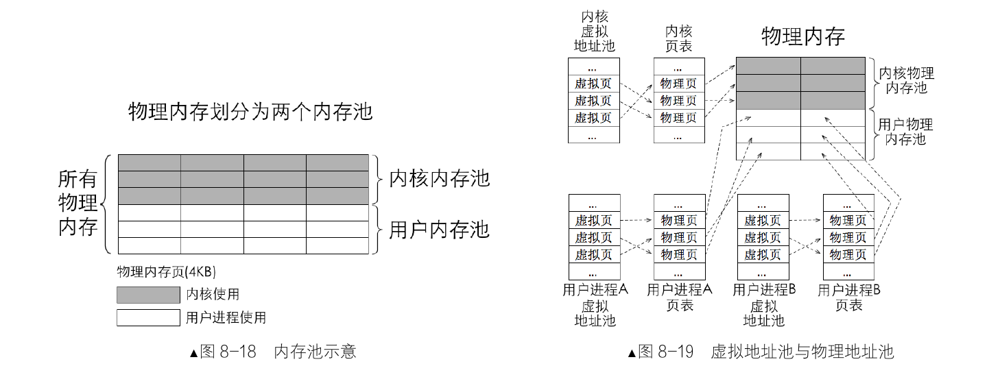
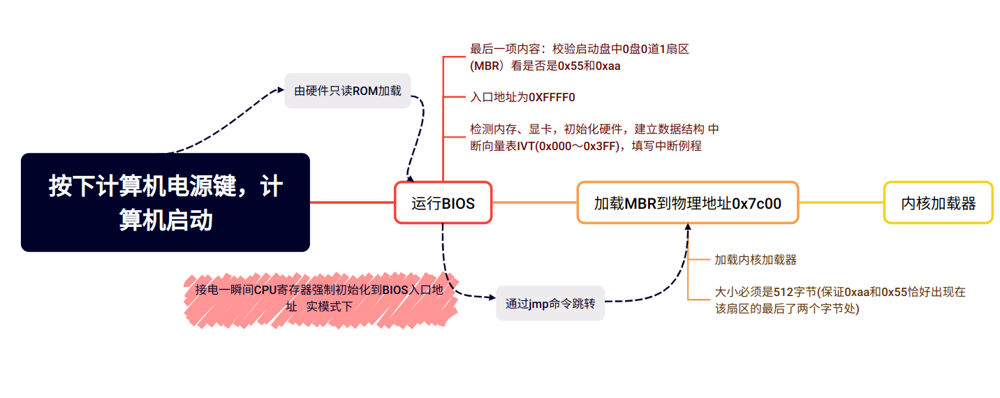
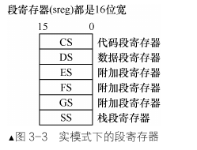

# 操作系统真相还原
 
-[真相还原gogogo!](#真相还原gogogo!)\
 -[第0章：一些你可能正感到迷惑的问题](#第0章：一些你可能正感到迷惑的问题)\
  -[软件如何访问硬件](#软件如何访问硬件)\
  -[特权级](#特权级)\
  -[内存访问为什么要分段](#内存访问为什么要分段)
  -[代码中为什么分为代码段、数据段？这和内存访问机制中的段是一回事吗](#代码中为什么分为代码段、数据段？这和内存访问机制中的段是一回事吗)\
  -[物理地址、逻辑地址、有效地址、线性地址、虚拟地址的区别](#物理地址、逻辑地址、有效地址、线性地址、虚拟地址的区别)\
  -[什么是段重叠](#什么是段重叠)\
  -[平坦模型](#平坦模型)\
  -[BIOS中断、DOS中断、Linux中断的区别](#BIOS中断、DOS中断、Linux中断的区别)\
  -[局部变量和函数参数为什么要放在栈中](#局部变量和函数参数为什么要放在栈中)\
  -[Section和Segment的区别](#Section和Segment的区别)\
  -[BIOS、MBR、DBR、OBR](#BIOS、MBR、DBR、OBR)
 -[第二章：编写MBR主引导记录，让我们开始掌权](#第二章：编写MBR主引导记录，让我们开始掌权)
  -[0x7c00?Why???](#0x7c00?Why???)
 -[第三章：完善MBR](#第三章：完善MBR)
  -[计算机启动过程](#计算机启动过程)
  -[CPU的实模式](#CPU的实模式)
  -[CPU工作原理](#CPU工作原理)
  -[CPU的寄存器](#CPU的寄存器)
  -[实模式下CPU内存寻址方式](#实模式下CPU内存寻址方式)
   -[寄存器寻址](#寄存器寻址)
   -[立即数寻址](#立即数寻址)
   -[内存寻址](#内存寻址)
   -[直接寻址](#直接寻址)
   -[]

## 第0章：一些你可能正感到迷惑的问题

### 软件如何访问硬件

+ 硬件更新非常迅速，操作系统为了适应各种不断迭代更新的硬件，出现了各种硬件适配器（`IO`接口）

+ 接口分为串行接口和并行接口

访问外部硬件有两个方式

1. 将某个外设的内存映射到一定范围的地址空间中,`CPU` 通过地址总线访问该内存区域时会落到外设的内存中,这种映射让 `CPU` 访问外设的内存就如同访问主板上的物理内存一样。例如显卡，显卡是显示器的适配器，CPU 不直接和显示器交互，它只和显卡通信。显卡上有片内存叫显存，它被映射到主机物理内存上的低端 1MB 的 0xB8000～0xBFFFF。CPU 访问这片内存就是访问显存，往这片内存上写字节便是往屏幕上打印内容。

2. 外设是通过 `IO` 接口与 `CPU` 通信的,`CPU` 访问外设,就是访问 `IO` 接口,由 `IO` 接口将信息传递给另一端的外设,也就是说,`CPU` 从来不知道有这些设备的存在,它只知道自己操作的 `IO` 接口。

>  如何访问到 `IO` 接口呢
>
> 答案就是 `IO` 接口上面有一些寄存器,访问 `IO` 接口本质上就是访问这些寄存器,这些寄存器就是人们常说的端口。这些端口是人家 `IO` 接口给咱们提供的接口。

------


### 特权级

+ 应用程序处于特权级 3,操作系统内核处于特权级 0。

+  扩展：

用户进程陷入内核态是指：由于内部或外部中断发生，当前进程被暂时终止执行，其上下文被内核的 中断程序保存起来后，开始执行一段内核的代码。是内核的代码，不是用户程序在内核的代码，用户代码 怎么可能在内核中存在，所以“用户态与内核态”是对 CPU 来说的。


### 内存访问为什么要分段

分段是给`CPU`用的访问内存的方式。

 + 早期程序运行时使用的是物理地址，编译后的代码在物理内存中起始地址相同，代码会发生冲突，相互覆盖。
 程序分段首先是为了重定位，重定位可以将物理地址冲突的程序挪到其他段

 + 程序分段首先是为了重定位，重定位可以将物理地址冲突的程序挪到其他段

> 1M 是 2 的 20 次方,1MB 内存需要 20 位的地址才能访问到,如何做到用 16 位寄存器访问 20 位地址空间呢?
>
> 这是因为 CPU 设计者在地址处理单元中动了手脚,该地址部件接到“段基址+段内偏移地址”的地址后,自动将段基址乘以 16,即左移了 4 位,然后再和 16 位的段内偏移地址相加,这下地址变成了 20 位了

------

#### 代码中为什么分为代码段、数据段？这和内存访问机制中的段是一回事吗

**程序不是一定要分段才能运行的,分段只是为了使程序更加优美。**

只要给出 `CPU` 第一个指令的起始地址,`CPU` 在它执行本指令的同时,它会自动获取下一条的地址,然后重复上述过程,继续执行,继续取址。这就要求程序中的指令都是挨着的，彼此之间无空隙。

> 程序中不是有对齐这回事吗?为了对齐,编译器在程序中塞了好多 0。是的,对齐确实是让程序中出现了好多空隙,但这些空隙是数据间的空隙,指令间不存在空隙,下一条指令的地址是按照前面指令的尺寸大小排下来的。即使指令间有空隙或其他非指令的数据,这也仅仅是在物理上将其断开了,依然可以用 `jmp`指令将非指令部分跳过以保持指令在逻辑上连续

**为了让程序内指令接连不断地执行,要把指令全部排在一起,形成一片连续的指令区域,这就是代码段。把数据连续地并排在一起存储形成的段落，就称为数据段。**

**尽量把同一属性的数据放在一起,这样易于维护。** 这样有以下好处：


- 可以为它们赋予不同的属性。数据需要有可写的属性，代码需要有只读的属性。
- 为了提高 `CPU` 内部缓存的命中率。
- 节省内存。程序中存在一些只读的部分,比如代码,当一个程序的多个副本同时运行时(比如同时执行多个 ls命令时),没必要在内存中同时存在多个相同的代码段,这将浪费有限的物理内存资源,只要把这一个代码段共享就可以了。

> 数据段或代码段的属性是谁给添加上的呢,是谁又去根据属性保护程序的呢
>
> 编译器.他负责挑选出数据具备的属性,从而根据属性将程序片段分类,比如,划分出了只读属性的代码段和可写属性的数据段。
>
> 操作系统通过设置 `GDT` 全局描述符表来构建段描述符,在段描述符中指定段的位置、大小及属性(包括 `S` 字段和 `TYPE` 字段)。是真正给段添加属性的地方。
>
> `CPU` 中的段寄存器提前被操作系统赋予相应的选择子,从而确定了指向的段。

总结一下,**程序中的段只是逻辑上的划分,用于不同数据的归类,但是可以用 `CPU` 中的段寄存器直接指向它们**,然后用内存分段机制去程序中分段在平坦模型中访问程序中的段。

内存分段机制？

------

#### 物理地址、逻辑地址、有效地址、线性地址、虚拟地址的区别

+ 物理地址就是物理内存真正的地址，相当于内存中每个存储单元的门牌号，具有唯一性。不管在什么模式下， 不管什么虚拟地址、线性地址，CPU 最终都要以物理地址去访问内存，只有物理地址才是内存访问的终点站。

+ 在实模式下，“段基址+段内偏移地址”经过段部件的处理，直接输出的就是物理地址，CPU 可以直 接用此地址访问内存。

+ 而在保护模式下，“段基址+段内偏移地址”称为线性地址，此时的段基址是选择子。

+ 若没有开启地址分页功能， 此线性地址就被当作物理地址来用，可直接访问内存。若开启了分页功能，此线性地址又多了一个名字，就是 虚拟地址。



------

#### 什么是段重叠

`CPU` 的内存寻址方式是:给我一个段基址,再给我一个相对于该段起始位置的偏移地址,我就能访问到相应内存。它并不要求一个内存地址只隶属于某一个段,所以在上面的图  中,欲访问内存 `0xC03`,段基址可以选择 `0xC00`, `0xC01`,`0xC02`,`0xC03`,只不过是段内偏移量要根据段基地址来调整罢了。用这种“段基地址:段内偏移”的组合,`0xC00:3` 和`0xC02:1` 是等价的,它们都访问到同一个物理内存块。但段的大小决定于段内偏移地址寻址范围,假设段 A 的段基址是从 0xC00 `开始`,段 B 的段基址是从 `0xC02` 开始,在 16 位宽度的寻址范围内,这两个段都能访问到 `0xC05` 这块内存。用段 A 去访问,其偏移为 5,用段 B 去访问,其偏移量为 3。这样一来,用段 B 和段 A 在地址 0xC02 之后,一直到段 B偏移地址为 `0xfffe` 的部分,像是重叠在一起了,这就是段重叠。


------


### 平坦模型

平坦模型（Flat Model）是一种**内存管理模型**，它将整个物理内存视为单一的、连续的地址空间，不区分段。这与分段模型和分页模型是相对的。

在平坦模型中，**内存地址由一个单一的线性地址空间表示，该空间从零开始，一直延伸到系统支持的最大物理地址。** 这种模型简化了内存管理，使得程序员不需要关心段的概念，而是使用连续的线性地址。

------


### 寄存器

`CS`—代码段寄存器(`Code Segment Register`),其值为代码段的段基值。

`DS`—数据段寄存器(`Data Segment Register`),其值为数据段的段基值

`ES`—附加段寄存器(`Extra Segment Register`),其值为附加数据段的段基值,称为“附加”是因为此段寄存器用途不像其他 `sreg` 那样固定,可以额外做他用。

`FS`—附加段寄存器(`Extra Segment Register`),其值为附加数据段的段基值,同上,用途不固定,使用上灵活机动。

`GS`—附加段寄存器(`Extra Segment Register`),其值为附加数据段的段基值。

`SS`—堆栈段寄存器(`Stack Segment Register`),其值为堆栈段的段值。

> 32 位 `CPU` 有两种不同的工作模式:实模式和保护模式。
> 每种模式下,段寄存器中值的意义是不同的,但不管其为何值,在段寄存器中所表达的都是指向的段在哪里。
>
> 在实模式下,`CS`、`DS`、`ES`、`SS` 中的值为段基址,是具体的物理地址,内存单元的逻辑地址仍为“段基值:段内偏移量”的形式。在保护模式下,装入段寄存器的不再是段地址,而是“段选择子”(`Selector`),当然,选择子也是数值,其依然为 16 位宽度。

综上所述，在32位CPU中，不管在16为实模式还是32位保护模式下，用的段寄存器都是同一组,`sreg` 都是 16 位宽。

------

### BIOS中断、DOS中断、Linux中断的区别
+ 如果事件来自于 CPU 内部就称为异常，即 Exception,如果事件来自于外部，也就是该事件由外部设备发出并通知了 CPU，这个事件就称为中断
+ 计算机 启动之初，中断向量表中的中断例程是由 BIOS 建立的，它从物理内存地址 0x0000 处初始化并在中断向 量表中添加各种处理例程
 > BIOS 为什么添加中断处理例程呢？
 > 
 > 1.给自己用，因为 BIOS 也是一段程序，是程序就很可能要重复性地执行某段代码，它直接将其写 成中断函数，直接调用多省心
 > 2.给后来的程序用，如加载器或 boot loader。它们在调用硬件资源时就不需要自己重写代码了

 ------

 > CPU 如何访问到外设的 ROM
 >
 > 1.内存映射：通过地址总线将外设自己的内存映射到某个内存区域（并不是映射到主板上插的内存条中）
 >  2.端口操作：外设都有自己的控制器，控制器上有寄存器，这些寄存器就是所谓的端口，通过 in/out 指令读写端口来访问硬件的内存

------
+ Linux中断

Linux 内核是在进入保护模式后才建立中断例程的，不过在保护模式下，中断向量表已经不存在了， 取而代之的是中断描述符表（Interrupt Descriptor Table，IDT）。Linux 的系统调用和 DOS 中断调用类似，不过 Linux 是通过 int 0x80 指令进入一个中断程序后再根据 eax 寄存器的值来调用不同的子功能函数的。如果在实模式下执行 int 指令，会自动去访问 中断向量表。如果在保护模式下执行 int 指令，则会自动访问中断描述符表


### 局部变量和函数参数为什么要放在栈中

局部变量只是自己在用,放在数据段中纯属浪费空间,没有必要,故将其放在自己的栈中,随时可以清理,真正体现了局部的意义。

函数参数为什么会放到栈区呢?

- 第一也是其局部性导致的,只有这个函数用这个参数,何必将其放在数据段呢。
- 第二,这是因为函数是在程序执行过程中调用的,属于动态的调用,编译时无法预测会何时调用及被调用的次数，其参数和函数的返回地址也要内存来存储,所以也不知道其会需要多少内存。

------

### Section和Segment的区别

section 称为节,是指在汇编源码中经由关键字 section 或 segment 修饰、逻辑划分的指令或数据区域,汇编器会将这两个关键字修饰的区域在目标文件中编译成节,也就是说“节”最初诞生于目标文件中。

segment 称为段,是链接器根据目标文件中属性相同的多个 section 合并后的 section 集合,这个集合称为 segment,也就是段,链接器把目标文件链接成可执行文件,因此段最终诞生于可执行文件中。

------


### BIOS、MBR、DBR、OBR

BIOS是计算机接电后运行的第一个程序

MBR会在BIOS干完一些基础工作后从BIOS那接手系统的控制权（BIOS将0盘0道1扇区的MBR加载到物理地址0x7c00）

MBR将系统控制权交给内核加载器OBR

MBR 引导扇区中的内容是：

   + 446 字节的引导程序及参数
   + 64 字节的分区表；
   + 2 字节结束标记 0x55 和 0xaa。


OBR是DBR遗留下来的,DBR 中的内容大概是：

   + 跳转指令，使 MBR 跳转到引导代码
   + 厂商信息、DOS 版本信息
   + BIOS 参数块 BPB，即 BIOS Parameter Block
   + 操作系统引导程序
   + 结束标记 0x55 和 0xaa


EBR是扩展分区中为了兼容 MBR 才提出的概念,主要是兼容 MBR 中的分区表。分区是用分区表来描述的,MBR 中有分区表,扩展分区中的是一个个的逻辑分区,因此扩展分区中也要有分区表,为扩展分区存储分区表的扇区称为 EBR,

------


## 编写MBR主引导记录，让我们开始掌权

### 0x7c00?Why???

+ BIOS 最后一项工作校验启动盘中位于 0 盘 0 道 1 扇区的内容

> 8086CPU 要求物理地址 0x0～0x3FF 存放中断向量表，所以此处不能动了，再选新的地方看看。 按 DOS 1.0 要求的最小内存 32KB 来说，MBR 希望给人家尽可能多的预留空间，这样也是保全自己 的作法，免得过早被覆盖。所以 MBR 只能放在 32KB 的末尾。 MBR 本身也是程序，是程序就要用到栈，栈也是在内存中的，MBR 虽然本身只有 512 字节，但还要为其 所用的栈分配点空间，所以其实际所用的内存空间要大于 512 字节，估计 1KB 内存够用了。 结合以上三点，选择32KB中的最后1KB最为合适，那此地址是多少呢？32KB换算为十六进制为0x8000， 减去 1KB(0x400)的话，等于 0x7c00。这就是倍受质疑的 0x7c00 的由来，这下清楚了

------


## 第三章：完善MBR

### 计算机启动过程



### CPU的实模式

实模式是指8086CPU的寻址方式、寄存器大小、指令用法等，可以反应CPU在该环境下如何工作。

**“实” 体现在程序中的地址都是真实的物理地址。**

#### CPU工作原理
CPU划为控制单元、运算单元、存储单元。
控制单元去下一条待运行的指令并存入指令译码器。指令译码器将相应的操作数从内存中取回放入自己的存储单元。运算单元开工

#### CPU的寄存器

寄存器是一种物理存储元件，比一般的存储介质要快。

一般分为两类：**对程序员可见的和对程序员不可见的（内部使用的）**，主要说下对程序员可见的寄存器。

**段寄存器**：指定一片内存的起始地址，也叫段基址，在实模式下乘以16,在保护模式下是一个选择子。



**通用寄存器（每个寄存器功能不单一）：** AX、BX、CX、DX、SI、DI、BP、SP

1. ​	**AX寄存器：累加器**，由AH寄存器（AX高8位）和AL寄存器（AX低8位）组成
2. ​	**CX寄存器：计数器**，用作循环次数的控制
3. ​	**BX寄存器：基址寄存器**，用于存储起始地址
4. ​	**DX寄存器：数据寄存器**，通常只用于保存外设控制器的端口号地址
5. ​	**SI寄存器：源変址寄存器**，用于字符串操作中的数据源地址，即被传送的数据在哪里
6. ​	**DI寄存器：目的変址寄存器**，和SI一样，但是是数据的目的地址，即被传送的数据目的地址在哪里
7. ​	**SP寄存器：栈指针寄存器**，段基址为SS,用来指向栈顶
8. ​	**BP寄存器：基址指针**，BP的方式把栈当成普通的数据段来访问

#### 实模式下CPU内存寻址方式

寻址方式，从大方向来看可以分为三大类：

+ 寄存器寻址
+ 立即数寻址
+ 内存寻址
  + 直接寻址
  + 基址寻址
  + 变址寻址
  + 基址变址寻址

#### 寄存器寻址

最直接的寻址方式就是寄存器寻址,它是指“数”在寄存器中,直接从寄存器中拿数据就行了。例如下面用 `mul` 指令实现 `0x10*0x9。`

```assembly
mov ax,0x10
mov dx,0x9
mul dx
```

同时这也是立即数寻址

#### 立即数寻址

```assembly
mov ax,0x18
mov ds,ax
```

第一条指令中的源操作数 `0x18` 是立即数,目的操作数 `ax` 是寄存器,所以它既是立即数寻址,也是寄存器寻址。第二条指令中,源操作数和目的操作数都是寄存器,所以纯粹是寄存器寻址。

下面也是立即数寻址

```assembly
mov ax,macro_selector
mov ax,label_start
```

第一条指令的源操作数 `macro_selector` 是个宏,第二条指令的源操作数 `label_start`是个标号,这两个在编译阶段会转换为数字,最终可执行文件中的依然是立即数。

#### 内存寻址

##### 直接寻址

直接寻址,就是将直接在操作数中给出的数字作为内存地址,通过中括号的形式告诉 `CPU`,取此地址中的值作为操作数。

```assembly
mov ax,[0x1234]
mov ax,[fs:0x5678]
```

注意，这里`0x1234`是段偏移地址，默认的段地址是`DS`，这条指令是将内存地址 `DS:0x1234` 处的值写入 `ax` 寄存器。段基址*16 变成 20 位地址后,再加上段内偏移地址 `0x1234`。


